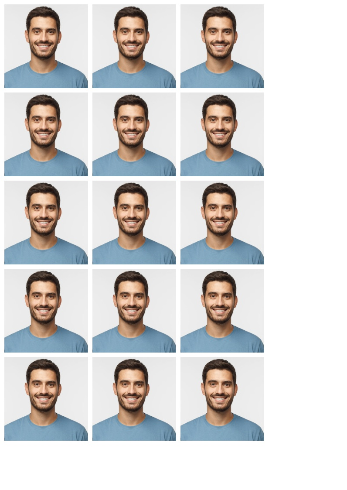

# Passport Image Grid Generator

## Install

```bash
git clone https://github.com/Prashant047/passport-image-grid-genertor.git
cd passport-image-grid-generator
source ./bin/activate
pip3 install -r requirements.txt
```

## Usage

```bash
python3 main.py your-image.jpg
```

## Example

```bash
python3 main.py ./test3.jpg
```

### example image


### output



### Dactivate the virtual env
```bash
deactivate
```
